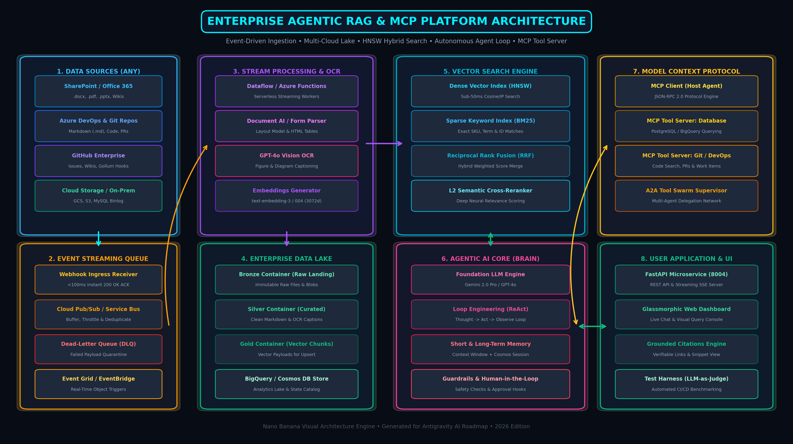
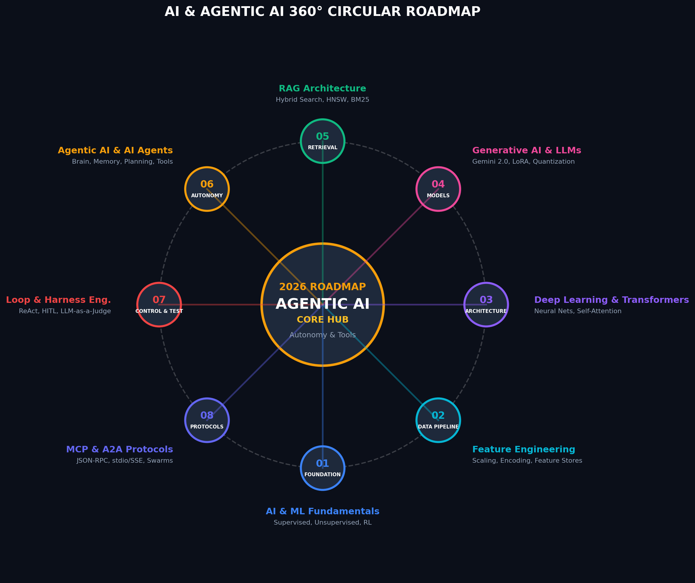

# Artificial Intelligence (AI) Master Study & Reference Guide

This directory contains foundational notes, term definitions, architectural cheat sheets, block-wise memory matrices, and learning materials covering core and modern Artificial Intelligence concepts.

---

## 📖 Primary Study Guides

* ⚡ [**`ai_quick_recall_cheat_sheet.md`**](file:///Users/biswanathgiri/GenAI%26AgenticAI%20-Learing%20Roadmap/AI/ai_quick_recall_cheat_sheet.md): **Block-Wise AI Memory Matrix & Easy Recall Guide**
  - Features 11 structured blocks with 1-line formulas, 5 key keywords, memory tricks, real-world examples, and interview answers!

* 📄 [**`ai_terms_cheat_sheet.md`**](file:///Users/biswanathgiri/GenAI%26AgenticAI%20-Learing%20Roadmap/AI/ai_terms_cheat_sheet.md): **Master AI Terms & Concepts Reference Guide**
  - Comprehensive, authoritative definitions across all AI domains.

---

## 🎯 Block-Wise Navigation Matrix

| Block # | Domain | Core Focus | Quick Reference File |
| :--- | :--- | :--- | :--- |
| **Block 1** | **Artificial Intelligence (AI)** | Rules, Expert Systems, Logic | [`ai_quick_recall_cheat_sheet.md`](file:///Users/biswanathgiri/GenAI%26AgenticAI%20-Learing%20Roadmap/AI/ai_quick_recall_cheat_sheet.md#1-artificial-intelligence-ai---the-umbrella) |
| **Block 2** | **Machine Learning (ML)** | Data-Driven Patterns | [`ai_quick_recall_cheat_sheet.md`](file:///Users/biswanathgiri/GenAI%26AgenticAI%20-Learing%20Roadmap/AI/ai_quick_recall_cheat_sheet.md#2-machine-learning-ml---data-driven-learning) |
| **Block 3** | **Feature Engineering** | Scaling, Encoding, Feature Stores | [`ai_quick_recall_cheat_sheet.md`](file:///Users/biswanathgiri/GenAI%26AgenticAI%20-Learing%20Roadmap/AI/ai_quick_recall_cheat_sheet.md#3-feature-engineering--feature-stores---data-optimization) |
| **Block 4** | **Deep Learning (DL)** | Multi-layer Neural Nets & Attention | [`ai_quick_recall_cheat_sheet.md`](file:///Users/biswanathgiri/GenAI%26AgenticAI%20-Learing%20Roadmap/AI/ai_quick_recall_cheat_sheet.md#4-deep-learning-dl--transformers---multi-layer-neural-nets) |
| **Block 5** | **Generative AI (GenAI)** | LLMs, Fine-Tuning, Quantization | [`ai_quick_recall_cheat_sheet.md`](file:///Users/biswanathgiri/GenAI%26AgenticAI%20-Learing%20Roadmap/AI/ai_quick_recall_cheat_sheet.md#5-generative-ai-genai--llms---content-creation) |
| **Block 6** | **Agentic AI** | Goal-Directed Autonomous Agents | [`ai_quick_recall_cheat_sheet.md`](file:///Users/biswanathgiri/GenAI%26AgenticAI%20-Learing%20Roadmap/AI/ai_quick_recall_cheat_sheet.md#6-agentic-ai--autonomous-ai-agents---goal-directed-autonomy) |
| **Block 7** | **Loop Engineering** | ReAct, HITL, Reflection, State | [`ai_quick_recall_cheat_sheet.md`](file:///Users/biswanathgiri/GenAI%26AgenticAI%20-Learing%20Roadmap/AI/ai_quick_recall_cheat_sheet.md#7-loop-engineering---iteration--state-control) |
| **Block 8** | **Test Harness Eng.** | LLM-as-a-Judge, Mocks, Benchmarks | [`ai_quick_recall_cheat_sheet.md`](file:///Users/biswanathgiri/GenAI%26AgenticAI%20-Learing%20Roadmap/AI/ai_quick_recall_cheat_sheet.md#8-test-harness-engineering---automated-evaluation--benchmarking) |
| **Block 9** | **RAG Architecture** | Hybrid Search, Vector, Citations | [`ai_quick_recall_cheat_sheet.md`](file:///Users/biswanathgiri/GenAI%26AgenticAI%20-Learing%20Roadmap/AI/ai_quick_recall_cheat_sheet.md#9-retrieval-augmented-generation-rag---knowledge-grounding) |
| **Block 10**| **MCP Protocol** | Universal Client-Server Tools | [`ai_quick_recall_cheat_sheet.md`](file:///Users/biswanathgiri/GenAI%26AgenticAI%20-Learing%20Roadmap/AI/ai_quick_recall_cheat_sheet.md#10-model-context-protocol-mcp---universal-tool-connection) |
| **Block 11**| **A2A Protocols** | Supervisor-Worker Tool Swarms | [`ai_quick_recall_cheat_sheet.md`](file:///Users/biswanathgiri/GenAI%26AgenticAI%20-Learing%20Roadmap/AI/ai_quick_recall_cheat_sheet.md#11-agent-to-agent-a2a-protocols---multi-agent-swarms) |
