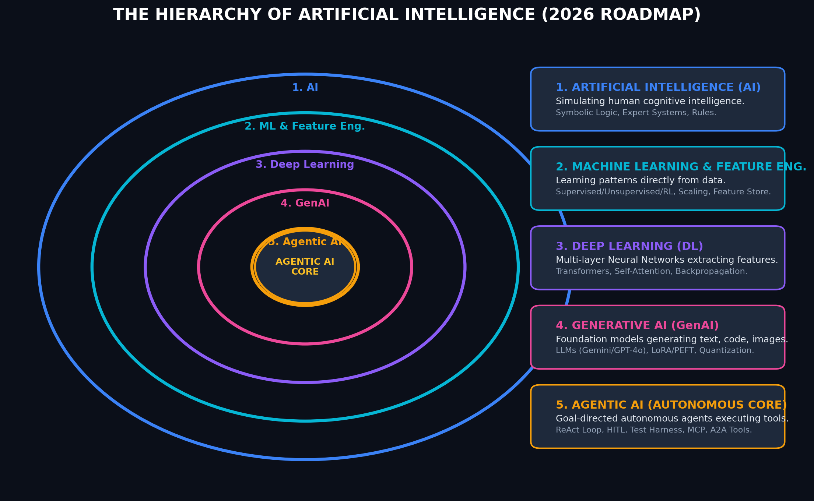

# Master AI Terms & Concepts Reference Guide
## Comprehensive Definitions: AI, ML, Deep Learning, Feature Engineering, GenAI, Agentic AI, RAG, MCP, A2A, Loop & Harness Engineering

This cheat sheet provides concise, clear, and authoritative definitions of fundamental and modern Artificial Intelligence terms, architectures, protocols, paradigms, and engineering disciplines essential to master.

---

## 📋 Table of Contents
* [1. Core Paradigm Hierarchy (AI vs ML vs DL vs GenAI vs Agentic AI)](#1-core-paradigm-hierarchy)
* [2. AI & Machine Learning Fundamentals](#2-ai--machine-learning-fundamentals)
* [3. Feature Engineering & Feature Stores](#3-feature-engineering--feature-stores)
* [4. Deep Learning & Neural Architectures](#4-deep-learning--neural-architectures)
* [5. Generative AI & Large Language Models (LLMs)](#5-generative-ai--large-language-models-llms)
* [6. Agentic AI & Autonomous AI Agents](#6-agentic-ai--autonomous-ai-agents)
* [7. Loop Engineering in Agentic AI](#7-loop-engineering-in-agentic-ai)
* [8. Test Harness Engineering (Evaluation Harnesses)](#8-test-harness-engineering-evaluation-harnesses)
* [9. Retrieval-Augmented Generation (RAG)](#9-retrieval-augmented-generation-rag)
* [10. Model Context Protocol (MCP)](#10-model-context-protocol-mcp)
* [11. Agent-to-Agent (A2A) Protocols & Tool Calling](#11-agent-to-agent-a2a-protocols--tool-calling)
* [12. Key Technical & Operational Terms](#12-key-technical--operational-terms)

---

## 1. Core Paradigm Hierarchy



```
┌────────────────────────────────────────────────────────────────────────┐
│                        ARTIFICIAL INTELLIGENCE (AI)                    │
│  ┌──────────────────────────────────────────────────────────────────┐  │
│  │                    MACHINE LEARNING (ML)                         │  │
│  │  ┌────────────────────────────────────────────────────────────┐  │  │
│  │  │   Feature Engineering & Feature Stores                     │  │  │
│  │  │  ┌──────────────────────────────────────────────────────┐  │  │  │
│  │  │  │               DEEP LEARNING (DL)                     │  │  │  │
│  │  │  │  ┌────────────────────────────────────────────────┐  │  │  │  │
│  │  │  │  │            GENERATIVE AI (GenAI)               │  │  │  │  │
│  │  │  │  │  ┌──────────────────────────────────────────┐  │  │  │  │  │
│  │  │  │  │  │           AGENTIC AI                     │  │  │  │  │  │
│  │  │  │  │  │ (Loop & Harness Engineering, MCP, A2A)   │  │  │  │  │  │
│  │  │  │  │  └──────────────────────────────────────────┘  │  │  │  │  │
│  │  │  │  └────────────────────────────────────────────────┘  │  │  │  │
│  │  │  └──────────────────────────────────────────────────────┘  │  │  │
│  │  └────────────────────────────────────────────────────────────┘  │  │
│  └──────────────────────────────────────────────────────────────────┘  │
└────────────────────────────────────────────────────────────────────────┘
```

---

## 2. AI & Machine Learning Fundamentals

### 1. Artificial Intelligence (AI)
*   **Definition**: The overarching field of computer science dedicated to building machines capable of performing tasks that typically require human intelligence (e.g., visual perception, speech recognition, decision-making, and language translation).
*   **Key Distinction**: Includes both rule-based symbolic systems (Expert Systems) and data-driven learning models.

### 2. Machine Learning (ML)
*   **Definition**: A subset of AI focused on building algorithms that learn patterns directly from data to make predictions or decisions without being explicitly programmed with manual rules.
*   **Core Categories**:
    *   *Supervised Learning*: Training on labeled data (e.g., Regression, Classification).
    *   *Unsupervised Learning*: Finding hidden patterns in unlabeled data (e.g., Clustering, PCA).
    *   *Reinforcement Learning (RL)*: Learning optimal actions through trial-and-error rewards in an environment.

---

## 3. Feature Engineering & Feature Stores

### 3. Feature Engineering
*   **Definition**: The engineering process of selecting, transforming, extracting, and creating raw data attributes (features) into numerical formats that maximize machine learning model predictive performance, stability, and interpretability.

```
┌────────────────────────────────────────────────────────────────────────┐
│                   FEATURE ENGINEERING PIPELINE                         │
├────────────────────────────────────────────────────────────────────────┤
│  Raw Data ──> Extraction ──> Scaling/Encoding ──> Selection ──> Model  │
│  (Text/Dates)  (TF-IDF/Day)   (One-Hot/Z-Score)   (RFE/Lasso)  (XGBoost)│
└────────────────────────────────────────────────────────────────────────┘
```

### 4. Core Feature Engineering Techniques
*   **Feature Extraction**: Converting raw unstructured data into numerical variables (e.g., extracting `hour_of_day`, `day_of_week`, `is_weekend` from timestamps; TF-IDF or Word Embeddings from text).
*   **Feature Scaling & Normalization**:
    *   *Standardization (Z-Score)*: Centers data to mean $\mu = 0$, standard deviation $\sigma = 1$ ($x' = \frac{x - \mu}{\sigma}$).
    *   *Min-Max Normalization*: Rescales range to $[0, 1]$ ($x' = \frac{x - x_{min}}{x_{max} - x_{min}}$).
*   **Categorical Encoding**:
    *   *One-Hot Encoding*: Converts categorical values into binary vectors ($0/1$).
    *   *Ordinal Encoding*: Maps ordered categories to sequential integers (e.g., Low=1, Med=2, High=3).
    *   *Target / Mean Encoding*: Replaces category values with the mean target value for that category.
*   **Missing Value Imputation**: Replacing missing values (`NaN`) using Mean, Median, Mode, or KNN Imputation.
*   **Feature Selection**: Filtering out irrelevant or redundant variables using Pearson Correlation, Recursive Feature Elimination (RFE), or Tree Importance (SHAP values).
*   **Dimensionality Reduction**: Compressing high-dimensional feature spaces using Principal Component Analysis (PCA), t-SNE, or UMAP.

### 5. Feature Store (e.g., Feast, Vertex AI Feature Store, Databricks)
*   **Definition**: A centralized enterprise repository that manages, stores, registers, and serves machine learning features consistently across both **offline training** (batch data lakes) and **online real-time inference** (low-latency key-value stores), preventing training-serving skew.

---

## 4. Deep Learning & Neural Architectures

### 6. Deep Learning (DL)
*   **Definition**: A subfield of ML based on Artificial Neural Networks with multiple hidden layers (Deep Neural Networks). Deep learning automatically extracts hierarchical features from raw, unstructured data (images, audio, text) without manual feature engineering.
*   **Key Components**: Neurons, Weights, Biases, Activation Functions, Backpropagation, Gradient Descent.

### 7. Transformer Architecture
*   **Definition**: A deep learning architecture introduced in 2017 ("Attention Is All You Need") relying on self-attention mechanisms to process input sequences in parallel, replacing sequential RNNs/LSTMs. It forms the backbone of all modern LLMs.

### 8. Self-Attention Mechanism
*   **Definition**: A mathematical technique allowing a model to dynamically compute relevance weights between every word/token in a sequence regardless of their distance (e.g., resolving "it" in a long sentence).

---

## 5. Generative AI & Large Language Models (LLMs)

### 9. Generative AI (GenAI)
*   **Definition**: A subset of Deep Learning powered by foundation models (LLMs, Diffusion Models) capable of generating brand new text, code, images, audio, video, or synthetic data based on learned prompt patterns.

### 10. Large Language Models (LLMs)
*   **Definition**: Massive transformer-based neural networks trained on vast text datasets (trillions of tokens) to predict the next token in a sequence, understanding and generating natural language (e.g., Gemini 2.0, GPT-4o, Claude 3.5).

### 11. Fine-Tuning & Parameter-Efficient Fine-Tuning (PEFT / LoRA)
*   **Definition**:
    *   *Fine-Tuning*: Further training a pre-trained LLM on a specific domain dataset to adjust its behavior.
    *   *LoRA (Low-Rank Adaptation)*: A PEFT method that freezes base model weights and trains a tiny adapter matrix ($< 1\%$ of parameters), drastically reducing GPU VRAM costs.

### 12. Quantization (GGUF / AWQ / GPTQ)
*   **Definition**: Compressing LLM model weights from high precision (FP32/FP16) down to lower precision (INT8/INT4), allowing massive models to run efficiently on edge devices or smaller GPUs with minimal loss of accuracy.

---

## 6. Agentic AI & Autonomous AI Agents

### 13. Agentic AI
*   **Definition**: An advanced AI paradigm where systems move beyond passive input-output text generation to exhibit **agency**, **goal-directed autonomy**, **multi-step planning**, and **tool execution** to accomplish complex tasks independently.

### 14. AI Agent (Autonomous Agent)
*   **Definition**: A software entity powered by an LLM core that acts autonomously by perceiving its environment, breaking high-level goals into sub-tasks (Planning), executing API/system tools (Tool Use), maintaining state (Memory), and reflecting on feedback to solve multi-step problems.

### 15. Core Agentic Components
```
┌────────────────────────────────────────────────────────────────────────┐
│                        AI AGENT ARCHITECTURE                           │
├────────────────────────────────────────────────────────────────────────┤
│  1. Brain / Core LLM : Reasoning, instruction parsing, & synthesis.    │
│  2. Memory          : Short-term (Context Window) & Long-term (Vector).│
│  3. Planning        : Task decomposition, Reflection, & ReAct loop.    │
│  4. Tool Integration: Web search, Code Interpreter, APIs, Databases.   │
└────────────────────────────────────────────────────────────────────────┘
```

---

## 7. Loop Engineering in Agentic AI

### 16. Loop Engineering
*   **Definition**: The engineering discipline of designing, controlling, and optimizing iterative execution loops in autonomous AI agents. Loop engineering governs state transitions, goal evaluation, error recovery, reflection cycles, and termination criteria.

```
┌────────────────────────────────────────────────────────────────────────┐
│                      AGENTIC LOOP ENGINEERING FLOW                     │
├────────────────────────────────────────────────────────────────────────┤
│  Thought ──> Action (Tool Call) ──> Observation ──> Reflection         │
│     ▲                                                    │             │
│     └──────────────────[Iterative Loop]──────────────────┘             │
│                         (Max Iterations Check)                         │
└────────────────────────────────────────────────────────────────────────┘
```

### 17. Core Loop Patterns
*   **ReAct Loop (Reason + Act)**: Interleaves reasoning ("Thought") with environment interaction ("Action") and output inspection ("Observation").
*   **Plan-Execute-Reflect Loop**: Generates a multi-step task plan, executes steps sequentially, evaluates results, and dynamically updates the remaining plan upon failure.
*   **Human-in-the-Loop (HITL)**: Pause points built into agent execution loops requiring explicit human review/approval before executing high-risk tool actions (e.g., executing SQL `DROP TABLE` or committing financial transactions).
*   **Infinite Loop Guard**: Hard execution boundaries (e.g., `max_iterations = 10`, timeout timers) preventing agents from getting stuck in repetitive tool loops.

---

## 8. Test Harness Engineering (Evaluation Harnesses)

### 18. Test Harness Engineering (Agent Evaluation Harness)
*   **Definition**: The engineering methodology of building automated, repeatable test environments and evaluation harnesses to systematically measure, benchmark, and regression-test AI agents and RAG pipelines for correctness, safety, and performance.

```
┌────────────────────────────────────────────────────────────────────────┐
│                     AGENT TEST HARNESS ENGINEERING                     │
├────────────────────────────────────────────────────────────────────────┤
│  Input Test Suite ──> [Agent Under Test] ──> Execution Logs & Output   │
│                                                     │                  │
│                                                     ▼                  │
│  [Assertions / Benchmark Criteria] ◄────── [LLM-as-a-Judge Evaluator]  │
│                                                     │                  │
│                                                     ▼                  │
│                                          [Pass/Fail Metric Report]     │
└────────────────────────────────────────────────────────────────────────┘
```

### 19. Key Test Harness Capabilities
*   **LLM-as-a-Judge**: Using an evaluation LLM (e.g., GPT-4o / Gemini 2.0 Pro) with strict rubrics to grade agent responses for Groundedness, Answer Relevance, and Faithfulness.
*   **Mock Environment Sandbox**: Mocking external APIs, databases, and filesystem tools so agents can be tested hermetically without production side-effects.
*   **Regression & Benchmark Datasets**: Automated execution of standard test suites (e.g., 50 golden Q&A pairs) in CI/CD pipelines (GitHub Actions / Cloud Build) before model deployment.

---

## 9. Retrieval-Augmented Generation (RAG)

### 20. Retrieval-Augmented Generation (RAG)
*   **Definition**: An architectural pattern that enhances LLM generation by retrieving relevant domain knowledge from external databases (Vector Stores, Graph DBs) before synthesizing an answer, eliminating model hallucinations and providing verifiable source citations.

### 21. Hybrid Search (Vector HNSW + Keyword BM25)
*   **Definition**: Combining Dense Vector Similarity Search (HNSW metric for semantic meaning) with Sparse Keyword Search (BM25 for exact SKU/name matching) merged via Reciprocal Rank Fusion (RRF) to optimize retrieval recall and precision.

### 22. L2 Semantic Reranker
*   **Definition**: A deep learning cross-encoder model applied after initial retrieval to evaluate the exact semantic alignment between the user query and candidate chunks, outputting refined relevance scores.

---

## 10. Model Context Protocol (MCP)

### 23. Model Context Protocol (MCP)
*   **Definition**: An open standard protocol created to provide a universal, standardized interface connecting AI applications (LLMs, IDEs, Agents) to external data sources, local filesystems, tools, and developer services seamlessly.

### 24. MCP Client-Server Architecture
```
┌─────────────────┐       MCP Protocol        ┌─────────────────┐
│   MCP Client    │  ──────────────────────>  │   MCP Server    │
│ (Antigravity/   │    (JSON-RPC 2.0 over     │ (Postgres, Git, │
│  Claude Desktop)│  <──────────────────────  │  File System)   │
└─────────────────┘      stdio / SSE)         └─────────────────┘
```

---

## 11. Agent-to-Agent (A2A) Protocols & Tool Calling

### 25. Agent-to-Agent (A2A) Protocol
*   **Definition**: A standardized communication protocol allowing multiple autonomous AI agents to discover, negotiate, delegate, and collaborate on complex tasks across distributed networks or cloud environments.

### 26. Supervisor-Worker Pattern
*   **Definition**: A multi-agent orchestration architecture where a central **Supervisor Agent** decomposes a master task into sub-goals and routes them to specialized **Worker Agents** (e.g., DevOps Agent, Security Agent, FinOps Agent), aggregating their results.

---

## 12. Key Technical & Operational Terms

### 27. Context Window & Context Caching
*   **Definition**:
    *   *Context Window*: The maximum number of tokens an LLM can process in a single prompt-response turn.
    *   *Context Caching*: Caching large static prompt elements (documentation, system prompts) in memory to reduce input token billing and response latency.

### 28. System Prompt & Guardrails
*   **Definition**:
    *   *System Prompt*: Top-level instructions specifying the LLM's persona, operational rules, constraints, and safety guidelines.
    *   *Guardrails*: Input/output filtering layers enforcing safety, data privacy, and preventing prompt injection or PII leakage.

---

## 🎯 Quick Reference Summary Table

| Term | Category | Primary Focus | Key Benefit |
| :--- | :--- | :--- | :--- |
| **AI** | Broad Field | Simulating human intelligence | Automation & decision systems |
| **ML** | Subfield | Learning patterns from data | Data-driven prediction |
| **Feature Engineering** | ML Discipline | Scaling, encoding, & selecting variables | Maximizes model accuracy |
| **Feature Store** | Infrastructure | Centralized feature storage & serving | Eliminates training-serving skew |
| **Deep Learning** | ML Technique | Multi-layer Neural Networks | Unstructured data processing |
| **GenAI** | DL Application | Content generation | Creative & code synthesis |
| **Agentic AI** | Paradigm | Autonomous goal planning | Independent task execution |
| **AI Agent** | Entity | LLM core + Tools + Memory | Multi-step problem solving |
| **Loop Engineering** | Engineering | Iterative state & ReAct control | Safe, deterministic agent loops |
| **Test Harness Eng.** | Testing | Automated evaluation & grading | Verifiable agent reliability |
| **RAG** | Architecture | Knowledge retrieval + Generation | Eliminates hallucinations |
| **MCP** | Protocol | Standardized tool/data integration | Universal LLM connectivity |
| **A2A Tools** | Interoperability | Multi-agent communication | Swarm collaboration |
