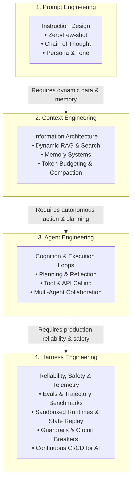
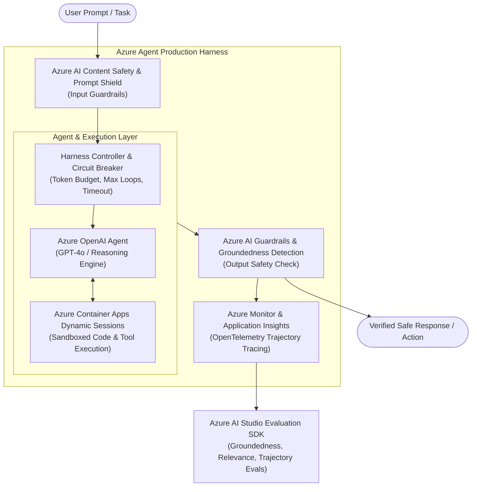
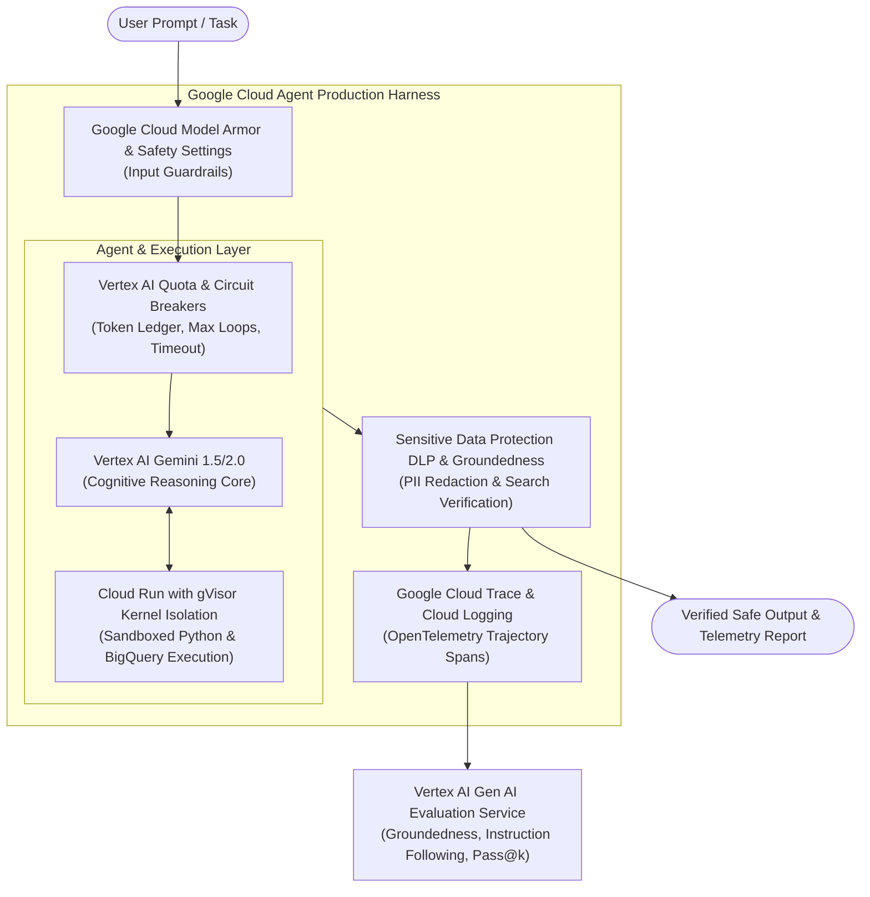
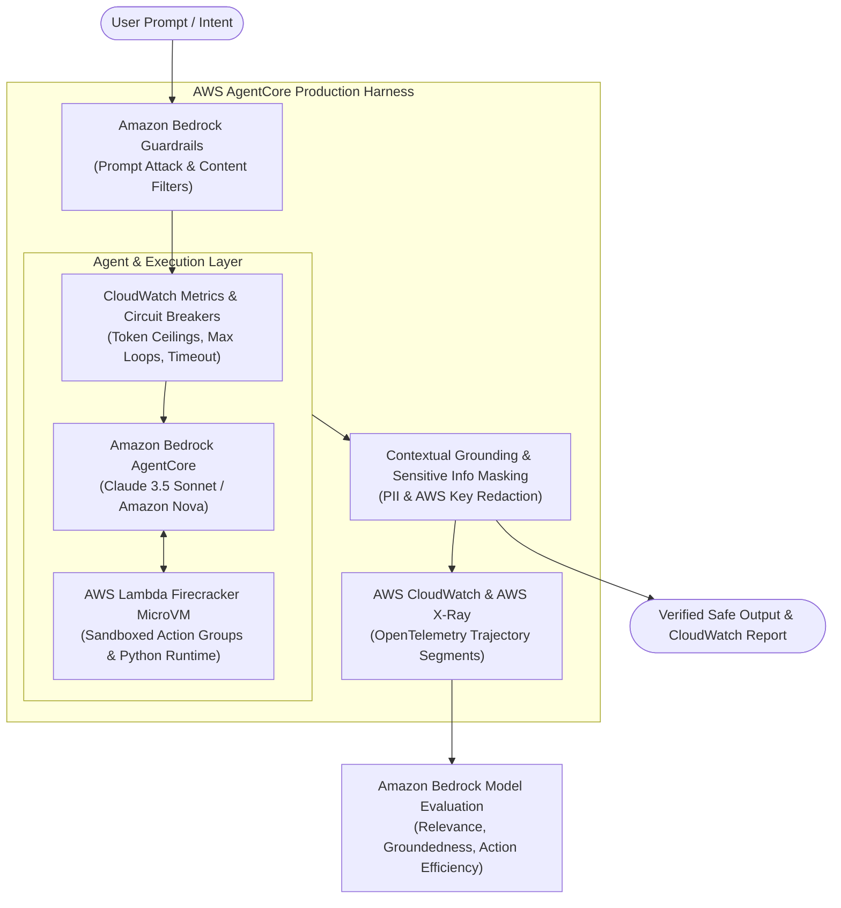
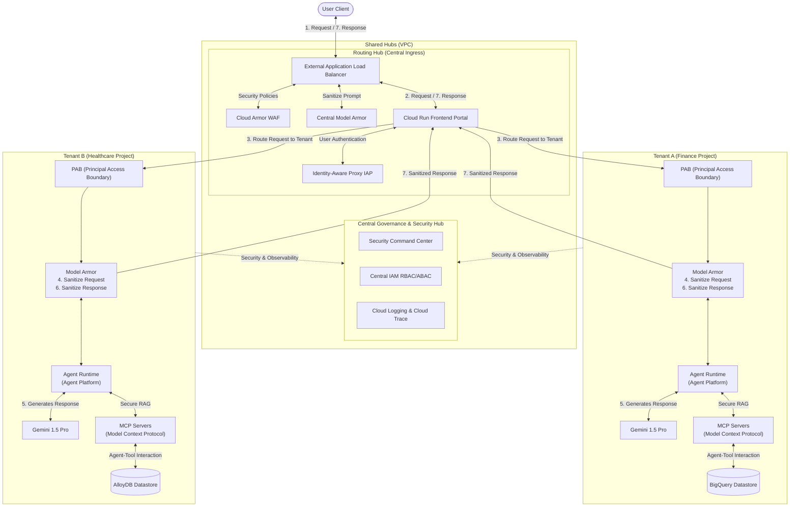

# The Evolution of LLM & AI System Development:
## Prompt Engineering → Context Engineering → Agent Engineering → Harness Engineering

---

## 📌 Executive Summary

Building production-grade Generative AI and Agentic systems has undergone a rapid paradigm shift. The engineering center of gravity has evolved from manipulating raw strings (**Prompt Engineering**) to assembling dynamic context (**Context Engineering**), orchestrating autonomous cognitive loops (**Agent Engineering**), and finally building rigorous, safe, and measurable production environments (**Harness Engineering**).



---

## 1. 🔤 Prompt Engineering (The Input Layer)

> **Core Philosophy:** *"How do we write the optimal text to elicit the desired response from the model?"*

### Key Concepts & Techniques
- **Zero-Shot & Few-Shot Prompting:** Providing task descriptions with or without canonical demonstration exemplars.
- **Reasoning Scaffolding:** 
  - Chain-of-Thought (CoT), Step-Back Prompting, Least-to-Most prompting.
  - ReAct (Reason + Act) prompting formats.
- **Formatting Directives & Personas:** System prompt personas, structured output schemas (JSON, YAML, Markdown), role assignments.
- **Delimiters & Defensive Prompting:** XML tags (`<context>`, `<instructions>`), Markdown headers, anti-jailbreak directives.

### Limitations & Failure Modes
- **Brittleness:** Minor prompt tweaks or underlying model updates drastically alter outputs.
- **Static Knowledge:** Limited strictly to parametric memory; susceptible to hallucination.
- **Token Ceiling & Context Rot:** Cannot scale to multi-turn workflows, massive repositories, or enterprise knowledge stores.

---

## 2. 🧠 Context Engineering (The Information & Memory Layer)

> **Core Philosophy:** *"How do we curate, compress, and deliver the highest-signal context window at inference time?"*

Context Engineering recognizes that LLMs are reasoning engines, not databases. The challenge is constructing the optimal dynamic prompt at runtime.

### Key Concepts & Techniques
- **Dynamic Retrieval-Augmented Generation (RAG):**
  - Hybrid search (BM25 lexical + dense vector embeddings).
  - Multi-query expansion, Reciprocal Rank Fusion (RRF), Cross-Encoder Re-ranking.
  - Knowledge graph retrieval (GraphRAG) for multi-hop relational context.
- **Context Window Management & Optimization:**
  - Token budgeting and prioritization.
  - Context compression (Selective Context, LLMLingua) and semantic deduplication.
  - Mitigating "Lost in the Middle" phenomena in long-context models.
- **Memory Systems:**
  - **Working/Short-Term Memory:** Sliding windows, conversation summarization.
  - **Episodic & Long-Term Memory:** User-specific facts, entity extraction, vector/relational persistence across sessions.

### Limitations & Failure Modes
- **Passive Nature:** Context is provided statically before generation; the model cannot autonomously gather follow-up data if initial retrieval misses.
- **Multi-Step Execution Deficit:** Cannot perform iterative tasks requiring intermediate actions or environment feedback.

---

## 3. 🤖 Agent Engineering (The Cognitive & Execution Layer)

> **Core Philosophy:** *"How do we empower the model to perceive, plan, act, reflect, and complete complex multi-step goals autonomously?"*

Agent Engineering turns models into autonomous actors capable of interacting with external tools, APIs, and file systems through iterative feedback loops.

```
       ┌──────────────────────────────────────────┐
       │                 GOAL                     │
       └────────────────────┬─────────────────────┘
                            ▼
      ┌──────────────────► PLAN ◄──────────────────┐
      │                     │                      │
      │                     ▼                      │
   REFLECT                EXECUTE                  │ Feedback /
(Self-Correction)   (Tool / API Invocation)        │ Observations
      ▲                     │                      │
      │                     ▼                      │
      └─────────────── ENVIRONMENT ────────────────┘
```

### Key Concepts & Techniques
- **Cognitive Architecture & Planning:**
  - Plan-and-Solve, Tree-of-Thoughts (ToT), Reflexion, and Self-Correction.
  - Dynamic replanning based on intermediate errors.
- **Tool Use & Function Calling:**
  - Schema-guided tool invocation (REST APIs, SQL executors, Bash/CLI, Python interpreters).
  - Parsing structured arguments and handling tool exceptions.
- **Agent Orchestration Patterns:**
  - **Single Agent ReAct Loops:** Iterative tool calling and observation loops.
  - **Hierarchical Multi-Agent:** Supervisor/Router dispatching to specialized domain subagents.
  - **Collaborative Swarms / Consensus:** Peer agents debating, reviewing, and approving actions (e.g., Coder + Reviewer).

### Limitations & Failure Modes
- **Compounding Non-Determinism:** Small errors in early reasoning steps cascade into unbounded loops, drift, or catastrophic execution errors.
- **Security & Blast Radius:** Agents executing code or updating databases can cause destructive side effects without containment.
- **Evaluation Blindness:** Hard to trace why an agent trajectory failed across dozens of tool calls.

---

## 4. 🛡️ Harness Engineering (The Production, Safety & Reliability Layer)

> **Core Philosophy:** *"How do we build the testing, execution, safety, and evaluation infrastructure required to operate agents reliably and deterministically in production?"*

Harness Engineering borrows from aerospace, compiler design, and systems engineering. The LLM/Agent is treated as a non-deterministic CPU; the **Harness** is the operating system, sandbox, hypervisor, and CI/CD testbed.

```
┌──────────────────────────────────────────────────────────────────┐
│                       HARNESS LAYER                              │
│                                                                  │
│  ┌────────────────────┐   ┌───────────────────────────────────┐  │
│  │ Safety Guardrails  │   │      Evaluation & CI Benchmarks   │  │
│  │ • Schema checks    │   │ • Trajectory unit tests           │  │
│  │ • Cost/Loop limits │   │ • SWE-bench / LLM-as-a-judge      │  │
│  │ • Policy filters   │   │ • Deterministic replay buffers    │  │
│  └─────────┬──────────┘   └─────────────────▲─────────────────┘  │
│            ▼                                │                    │
│  ┌──────────────────────────────────────────┴─────────────────┐  │
│  │          Sandboxed Execution Environment                   │  │
│  │ • Ephemeral containers (Docker, gVisor, WASM)              │  │
│  │ • Virtual file systems & Mocked APIs                       │  │
│  │ • Reversible state checkpoints (Git, snapshotting)         │  │
│  └────────────────────────┬───────────────────────────────────┘  │
│                           ▼                                      │
│  ┌────────────────────────────────────────────────────────────┐  │
│  │               Full Trajectory Observability                │  │
│  │ • OpenTelemetry traces, token metrics, cost ledger         │  │
│  └────────────────────────────────────────────────────────────┘  │
└───────────────────────────────────┬──────────────────────────────┘
                                    │ wraps
                                    ▼
                         [ Agent / Model Engine ]
```

### Key Pillars of Harness Engineering

#### 1. Evaluation & Benchmarking Harnesses (Evals as Code)
- **Trajectory Testing:** Evaluating not just the final output, but the validity and efficiency of the agent's path (e.g., number of tool calls, error recovery rate).
- **Synthetic Test Suites & Mocks:** Running agents against deterministic mock environments and golden datasets (e.g., SWE-bench, GAIA).
- **LLM-as-a-Judge & Heuristic Scoring:** Automated grading of correctness, tone, security compliance, and latency.

#### 2. Sandboxing & Safe Runtimes
- **Isolation:** Ephemeral containerized environments (Docker, Firecracker, gVisor, WebAssembly) for safe code and bash execution.
- **State Rollbacks & Snapshots:** Snapshotting file systems and database states to allow safe backtracking when an agent takes a wrong branch.
- **Access Control & Human-in-the-Loop (HITL):** Gating high-risk actions (payment processing, production database writes) behind deterministic permission gates.

#### 3. Deterministic Control & Guardrails
- **Grammar & Schema Enforcement:** Constraining model outputs at the logit level (e.g., Outlines, Guidance, SGLang) for 100% valid JSON/code syntax.
- **Circuit Breakers & Resource Quotas:** Maximum iteration limits, timeout budgets, token spend ceilings, and loop detection algorithms.
- **Input/Output Filtering:** Content safety, PII redaction, prompt injection defense (e.g., NeMo Guardrails, Llama Guard).

#### 4. Observability, Telemetry & Replayability
- **Traceability:** Recording every prompt, raw LLM completion, tool payload, and latency metric using standards like OpenTelemetry.
- **Deterministic Replay:** Storing full execution transcripts to replay and debug agent sessions step-by-step when failures occur.

---

## 📊 Comparative Matrix: The 4 Paradigms

| Dimension | 1. Prompt Engineering | 2. Context Engineering | 3. Agent Engineering | 4. Harness Engineering |
| :--- | :--- | :--- | :--- | :--- |
| **Primary Goal** | Direct model outputs via linguistic phrasing | Maximize relevant signal-to-noise ratio in context | Enable autonomous multi-step reasoning & tool execution | Ensure determinism, safety, evaluation & production stability |
| **Primary Artifact** | Prompt templates, system instructions | RAG pipelines, vector indexes, memory stores | Cognitive loops, tool schemas, multi-agent graphs | Sandboxes, evals, guardrails, telemetry collectors |
| **Core Abstraction** | Strings / Prompts | Tokens / Chunks / Embeddings | Actions / Tools / Trajectories | Testbeds / Environments / Control Policies |
| **Main Failure Mode** | Hallucination, fragile responses | Context overflow, irrelevant retrieval, stale data | Infinite loops, cascading tool errors, goal drift | Environment leakage, unrepresentative benchmarks, flaky evals |
| **Key Metric** | Output quality, BLEU / ROUGE | Precision@K, Recall, Needle-in-Haystack retrieval score | Task success rate, Trajectory efficiency | Pass@k, Cost/run, Replay fidelity, Safety violation rate |
| **Representative Tools** | PromptBase, Langfuse, DSPy | Pinecone, Chroma, LlamaIndex, Unstructured | LangGraph, AutoGen, CrewAI, Smagents | SWE-bench, DeepEval, OpenTelemetry, Docker, LangSmith |

---

## 🚀 Key Takeaways for AI Engineers

1. **Prompt Engineering is the starting point, not the destination:** Phrasing matters, but instructions cannot compensate for missing context, missing tools, or broken harnesses.
2. **Context is the true differentiator:** High-performing models are only as good as the domain knowledge, memory, and runtime state supplied to them.
3. **Agency requires structure:** Giving an LLM open-ended agency without strong graph workflows and tool boundaries leads to compounding errors.
4. **Harness Engineering is the moat for production systems:** Enterprises do not ship raw agents; they ship agents wrapped in robust testing harnesses, sandboxed execution environments, guardrails, and telemetry.

---

## 5. ☁️ Enterprise Case Study: Azure Harness Engineering Demo

To demonstrate Harness Engineering in a real-world enterprise cloud environment, we implement an **Azure AI Agent Harness** leveraging Microsoft Azure's cloud-native reliability, safety, and evaluation stack:



### Azure Harness Tech Stack

1. **Safety & Guardrail Harness:**
   - **Azure AI Content Safety:** Real-time toxicity, hate speech, and PII filtering.
   - **Azure Prompt Shield:** Detection of Direct & Indirect Prompt Injection attacks.
   - **Groundedness Detection:** Verifying that agent outputs are anchored in retrieved grounding documents.
2. **Execution & Sandboxing Harness:**
   - **Azure Container Apps (ACA) Dynamic Sessions:** Hyper-V / Firecracker-isolated ephemeral Python & bash execution environments for executing arbitrary agent-generated code safely with zero host access.
3. **Control & Circuit Breaker Harness:**
   - **Token & Cost Ledger:** Hard ceiling on session token consumption.
   - **Loop Detector & Step Limiter:** Terminating execution if an agent repeats failed tool calls or exceeds $N$ iterations.
4. **Observability & Trajectory Telemetry:**
   - **Azure Application Insights (OpenTelemetry):** Distributed tracing across LLM calls, tool executions, and guardrail verdicts.
5. **Continuous Evaluation Harness:**
   - **Azure AI Evaluation SDK (`azure-ai-evaluation`):** Automated evaluation pipelines computing *Relevance*, *Groundedness*, *Coherence*, and *Trajectory Efficiency (Pass@k)*.

👉 See the complete runnable demo code and architectural implementation in the [`azure_harness_demo/`](file:///Users/biswanathgiri/GenAI%26AgenticAI%20-Learing%20Roadmap/azure_harness_demo) directory.

---

## 6. 🌐 Enterprise Case Study: Google Cloud Platform (GCP) Harness Engineering

Alongside Azure, Google Cloud provides a cloud-native agent production harness built on Vertex AI, Google Cloud Model Armor, gVisor, and Cloud Trace:



### GCP Harness Tech Stack

1. **Safety & Guardrails:**
   - **Google Cloud Model Armor:** Real-time sanitization of direct prompt injection, jailbreaks, and malicious URLs.
   - **Vertex AI Safety Attributes:** Severity scoring across Harassment, Hate Speech, and Dangerous Content.
   - **Cloud Sensitive Data Protection (DLP):** Real-time detection and redaction of PII, credit cards, and API secrets.
2. **Execution & Sandboxing:**
   - **Cloud Run with gVisor Kernel Isolation:** Application-kernel level micro-virtualization preventing unauthorized system calls.
   - **Workload Identity Federation:** Least-privilege IAM access for tool and database invocations.
3. **Control & Circuit Breakers:**
   - **Vertex AI Token Quota Ledger:** Session token consumption boundaries.
   - **Step Governor & Failure Halter:** Intercepts runaway loops and repeated tool failures.
4. **Distributed Observability:**
   - **Google Cloud Trace & Cloud Logging:** OpenTelemetry distributed spans across agents, tools, and guardrails.
5. **Continuous Evaluation:**
   - **Vertex AI Gen AI Evaluation Service (`vertexai.preview.evaluation`):** Automated evaluation pipelines computing *Groundedness*, *Instruction Following*, and *Trajectory Pass@k*.

👉 See the complete runnable demo code in the [`gcp_harness_demo/`](file:///Users/biswanathgiri/GenAI%26AgenticAI%20-Learing%20Roadmap/gcp_harness_demo) directory.

---

## 7. 🟧 Enterprise Case Study: Amazon Web Services (AWS) Harness Engineering with AgentCore

AWS provides a specialized enterprise production harness built on **Amazon Bedrock**, **Bedrock AgentCore Engine**, **Bedrock Guardrails**, **AWS Lambda Firecracker MicroVMs**, and **CloudWatch/X-Ray**:



### AWS Harness Tech Stack

1. **Safety & Guardrails:**
   - **Amazon Bedrock Guardrails:** Prompt Attack Filter (direct injection & jailbreak defense), Content & Denied Topic Filters.
   - **Sensitive Information Filters:** Real-time masking of SSNs, credit cards, and AWS Access Keys.
   - **Contextual Grounding Check:** Validates factual claims against Amazon Bedrock Knowledge Bases (OpenSearch Serverless).
2. **Execution & Sandboxing:**
   - **AWS Lambda with Firecracker MicroVM Isolation:** KVM-based isolated action group execution preventing host kernel tampering.
   - **AWS IAM Least Privilege:** Tight IAM execution role boundaries for DynamoDB and S3 data access.
3. **Control & Circuit Breakers:**
   - **Bedrock Token Budget Ledger:** CloudWatch metric alarms for session token ceilings.
   - **Max Step / ReAct Limiter & Action Error Halter:** Immediate halt upon recursive looping or repeated tool exceptions.
4. **Distributed Observability:**
   - **AWS CloudWatch & AWS X-Ray:** OpenTelemetry distributed segments across reasoning traces, Action Groups, and guardrails.
5. **Continuous Evaluation:**
   - **Amazon Bedrock Automated Model Evaluation:** Evaluates Intent Relevance, Groundedness, and Action Group Pass@k efficiency.

👉 See the complete runnable demo code in the [`aws_harness_demo/`](file:///Users/biswanathgiri/GenAI%26AgenticAI%20-Learing%20Roadmap/aws_harness_demo) directory.

---

## 8. 🏢 Enterprise Architecture: Google Cloud Multi-Tenant Agent Platform (Shared Hubs & PAB)

For large-scale enterprise deployments with multiple business units (Finance, Healthcare, Sales), Google Cloud provides a reference **Multi-Tenant Agentic AI Architecture** implementing perimeter security, tenant isolation, dual-layer Model Armor, and Model Context Protocol (MCP) tool integration:



### Key Architectural Pillars

1. **Shared Routing Hub (Central Ingress):**
   - **External Application Load Balancer:** Anycast SSL termination and Layer 7 traffic routing.
   - **Cloud Armor:** WAF rules blocking OWASP attacks, SQLi, and Layer 7 DDoS.
   - **Central Model Armor:** Edge prompt inspection intercepting direct injection and jailbreaks before tenant routing.
   - **Identity-Aware Proxy (IAP):** SSO and context-aware identity authentication.
   - **Cloud Run Frontend:** Lightweight, serverless portal managing tenant routing.
2. **PAB (Principal Access Boundaries):**
   - Enforces strict cryptographically verified tenant project isolation, ensuring zero cross-tenant resource visibility.
3. **Tenant Projects (Model Armor + MCP + Gemini):**
   - **Tenant Model Armor:** Performs **Step 4 (Ingress Sanitization)** and **Step 6 (Egress Sanitization & Cloud DLP PII Redaction)**.
   - **MCP Servers (Model Context Protocol):** Standardized open tool integration for **Secure RAG** over isolated datastores (**BigQuery**, **AlloyDB**).
   - **Gemini Agent Platform:** Foundation model cognitive reasoning engine.
4. **Central Governance & Security Hub:**
   - Unified Security Command Center (SCC), Central IAM, and Cloud Logging auditing all cross-tenant events.

👉 See the complete runnable demo code in the [`gcp_multitenant_agent_platform/`](file:///Users/biswanathgiri/GenAI%26AgenticAI%20-Learing%20Roadmap/gcp_multitenant_agent_platform) directory.

---

## 8. 💰 FinOps for the Agentic Harness (The Hidden Cost of Non-Functional LLM Calls)

> **Core Philosophy:** *"How do we govern, measure, and optimize the unit economics of autonomous agent harnesses where non-functional LLM calls account for 75%+ of token bills?"*

In enterprise deployments, a single user prompt frequently triggers a cascade of **4 to 12 auxiliary LLM calls** inside the harness for:
- **Pre-Execution Guardrails:** Prompt injection scanning, jailbreak detection, ingress PII scrubbing.
- **Memory & State:** Working memory rolling summarization, episodic memory extraction, listwise candidate reranking.
- **Post-Execution Guardrails:** Groundedness & hallucination audits (repassing full retrieved context), corporate tone and egress compliance.
- **Automated Evals (LLM-as-a-Judge):** Context relevance, trajectory correctness, and safety scoring.

### The Token Amplification Factor (TAF) & Unit Economics
- **TAF (Token Amplification Factor):** $\frac{\text{Total Billed Tokens}}{\text{Functional Agent Prompt + Answer Tokens}}$. In unmanaged harnesses, TAF routinely reaches **8× to 15×**.
- **Non-Functional Token Ratio (NFTR):** Typically **75%–85%** of monthly API bills.

### The FinOps Solution Matrix
1. **Model Tiering & SLM Offloading:** Use dedicated Small Language Models (e.g. Llama-Guard 3 8B, fine-tuned DeBERTa, or Gemini Flash) for guardrails at 95%+ discount compared to frontier models.
2. **Deterministic-First Filtering:** Eliminate token costs on obvious attacks and PII with CPU-based regex, Aho-Corasick, and Presidio filters.
3. **Prompt Prefix Caching:** Exploit 50%–90% provider caching discounts on static system instructions and tool schemas.
4. **Sampled Asynchronous Evals:** Decouple inline LLM judges from live traffic; evaluate a 5% stratified random sample asynchronously via 50%-discounted Batch APIs.
5. **Token Leaky Bucket Circuit Breakers:** Enforce hard constraints on max tool hops, turn token budgets, and dollar ceilings per turn.

```
   UNMANAGED HARNESS                            FINOPS-GOVERNED HARNESS
   Cost / 1k turns: $81.82                      Cost / 1k turns: $17.20 (-79.0%)
   Non-Functional Ratio: 76.5%                  Non-Functional Ratio: 31.2%
   TAF: 4.25x                                   TAF: 1.45x
```

👉 **Full Master Reference:** Read the complete guide in [`FinOps_for_Agentic_Harness.md`](file:///Users/biswanathgiri/GenAI%26AgenticAI%20-Learing%20Roadmap/FinOps_for_Agentic_Harness.md).  
👉 **Interactive Simulator Tool:** Explore the runnable code in [`finops_agentic_harness/`](file:///Users/biswanathgiri/GenAI%26AgenticAI%20-Learing%20Roadmap/finops_agentic_harness/).  
👉 **Architecture Diagram:** View the visual architecture [`finops_agentic_harness_architecture.png`](file:///Users/biswanathgiri/GenAI%26AgenticAI%20-Learing%20Roadmap/finops_agentic_harness_architecture.png).

