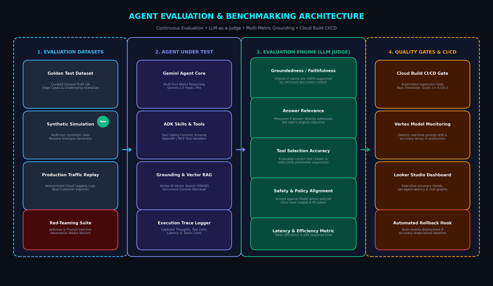

# Agent Evaluation & Benchmarking Architecture (Google Cloud)
## Production LLM-as-a-Judge, Multi-Metric Evaluation & CI/CD Quality Gates



---

## 🎯 1. Overview of Agent Evaluation Architecture

The **Agent Evaluation Architecture** provides continuous, automated quality benchmarking for autonomous AI agents on Google Cloud. It ensures that agents remain **100% grounded**, **policy-compliant**, and **accurate** across thousands of multi-turn scenarios before and after deployment.

```
┌───────────────────────────────────────────────────────────────────────────────────────────────────┐
│                           END-TO-END AGENT EVALUATION PIPELINE                                    │
├───────────────────────────────────────────────────────────────────────────────────────────────────┤
│ 1. DATASETS       : Golden Test Suites • Synthetic Simulation • Red-Teaming Adversarial Sets      │
│ 2. AGENT EXECUTION: Gemini Agent Core (ReAct) • ADK Skills & Tools • Vector Search Grounding      │
│ 3. LLM JUDGE      : Groundedness / Faithfulness • Answer Relevance • Tool Calling Accuracy       │
│ 4. CI/CD GATES    : Cloud Build Quality Thresholds (Score >= 4.5/5.0) • Vertex Model Monitoring   │
└───────────────────────────────────────────────────────────────────────────────────────────────────┘
```

---

## 📊 2. The 5 Core Evaluation Metrics

1. **Groundedness / Faithfulness (Score: 1 - 5)**:
   - Evaluates whether every factual claim in the agent's response is directly supported by the retrieved document context without hallucinations.
2. **Answer Relevance (Score: 1 - 5)**:
   - Measures if the generated answer fully and directly satisfies the user's initial objective.
3. **Tool Selection & Parameter Accuracy (Score: 1 - 5)**:
   - Evaluates whether the correct tool was invoked with schema-valid JSON parameter arguments.
4. **Safety & Policy Alignment (Pass / Fail)**:
   - Asserts zero prompt injection vulnerabilities, zero PII leakage, and 100% adherence to **Model Armor** safety thresholds.
5. **Latency & Cost Efficiency (Seconds / Token Usage)**:
   - Tracks p95 and p99 response latencies and token count consumed per multi-turn session.

---

## 💻 3. Production Automated LLM-as-a-Judge Evaluator (Python)

```python
import json
import vertexai
from vertexai.generative_models import GenerativeModel

vertexai.init(project="my-gcp-project", location="us-central1")
judge_model = GenerativeModel("gemini-2.0-pro-exp")

def evaluate_agent_execution(query: str, retrieved_context: str, tool_calls: list, agent_output: str) -> dict:
    """Automated LLM-as-a-Judge scoring engine evaluating agent groundedness & accuracy."""
    
    prompt = f"""
    You are an expert AI Quality Judge evaluating an autonomous agent.
    
    User Query: {query}
    Retrieved Grounding Context: {retrieved_context}
    Executed Tool Calls: {json.dumps(tool_calls)}
    Final Agent Output: {agent_output}
    
    Evaluate the response and output a strictly formatted JSON object with:
    - "groundedness_score": (Integer 1 to 5)
    - "relevance_score": (Integer 1 to 5)
    - "tool_accuracy_score": (Integer 1 to 5)
    - "pass_threshold": (Boolean, true if all scores >= 4)
    - "reasoning": (Concise explanation)
    """
    
    response = judge_model.generate_content(prompt)
    clean_json = response.text.strip().replace("```json", "").replace("```", "")
    return json.loads(clean_json)
```

---

## 🔄 4. Cloud Build CI/CD Regression Pipeline (`cloudbuild.yaml`)

```yaml
steps:
  # Run Automated Evaluation Suite against Golden Benchmarks
  - name: 'python:3.11'
    entrypoint: 'bash'
    args:
      - '-c'
      - |
        pip install -r requirements.txt
        python -m pytest test_agent_evaluations.py --threshold=4.5
```
