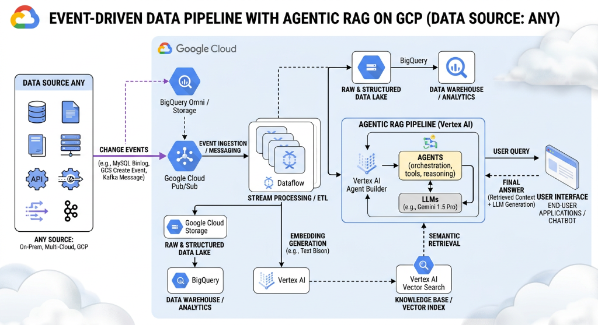
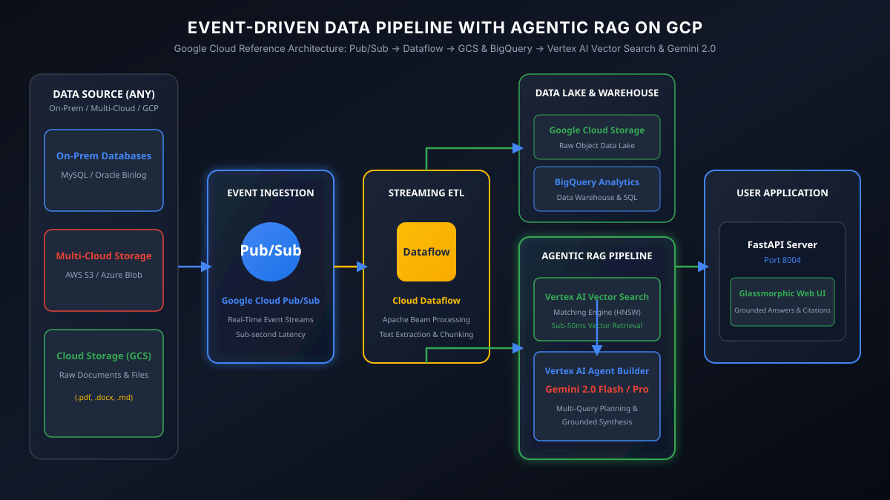
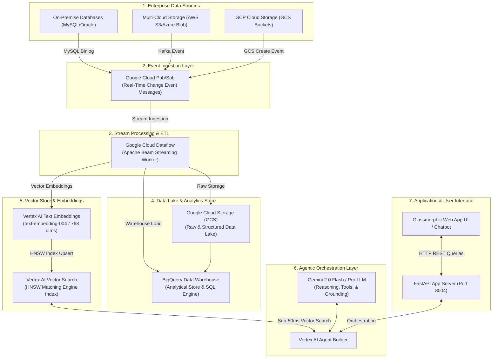

# GCP Agentic RAG Demo Platform
## Event-Driven Data Pipeline & Agentic RAG Architecture on Google Cloud





* 📄 [**`gcp_architecture_diagram.md`**](file:///Users/biswanathgiri/GenAI%26AgenticAI%20-Learing%20Roadmap/gcp_agentic_rag_demo/gcp_architecture_diagram.md): Dedicated Architecture Blueprint with Mermaid & ASCII flowcharts.

This repository provides a working, production-grade **GCP Agentic RAG Application** built according to Google Cloud Event-Driven Agentic RAG Reference Architecture guidelines.



---

## 🏗️ Google Cloud Architecture Overview

```
┌───────────────────────────────────────────────────────────────────────────────────────────────────┐
│                                   ENTERPRISE DATA SOURCES                                         │
│   ┌───────────────────────────┐   ┌───────────────────────────┐   ┌────────────────────────────┐  │
│   │    On-Premise Databases   │   │  Multi-Cloud Object Store │   │  GCP Cloud Storage (GCS)   │  │
│   └─────────────┬─────────────┘   └─────────────┬─────────────┘   └─────────────┬──────────────┘  │
└─────────────────┼───────────────────────────────┼───────────────────────────────┼─────────────────┘
                  │                               │                               │
                  ▼                               ▼                               ▼
┌───────────────────────────────────────────────────────────────────────────────────────────────────┐
│                               EVENT INGESTION & MESSAGING LAYER                                   │
│  ┌─────────────────────────────────────────────────────────────────────────────────────────────┐  │
│  │  Google Cloud Pub/Sub (Real-Time Change Event Ingestion)                                    │  │
│  └───────────────────────────────────────────┬─────────────────────────────────────────────────┘  │
└──────────────────────────────────────────────┼────────────────────────────────────────────────────┘
                                               │
                                               ▼
┌───────────────────────────────────────────────────────────────────────────────────────────────────┐
│                             STREAM PROCESSING & ETL PIPELINE                                      │
│  ┌─────────────────────────────────────────────────────────────────────────────────────────────┐  │
│  │  Google Cloud Dataflow (Apache Beam) -> Vertex AI Text Embeddings (768/3072 dims)           │  │
│  └───────────────────┬───────────────────────────────────────────────┬─────────────────────────┘  │
└──────────────────────┼───────────────────────────────────────────────┼────────────────────────────┘
                       │                                               │
                       ▼                                               ▼
┌──────────────────────────────────────────────┐     ┌──────────────────────────────────────────────┐
│           VERTEX AI VECTOR SEARCH            │     │         BIGQUERY DATA WAREHOUSE              │
│        (HNSW Matching Engine Index)          │     │        (Raw & Structured Data Lake)          │
└──────────────────────┬───────────────────────┘     └──────────────────────────────────────────────┘
                       │                                               ▲
                       ▼                                               │
┌──────────────────────────────────────────────────────────────────────┴────────────────────────────┐
│                              AGENTIC RAG ORCHESTRATION LAYER                                      │
│  ┌─────────────────────────────────────────────────────────────────────────────────────────────┐  │
│  │  Vertex AI Agent Builder + Gemini 2.0 Flash/Pro LLM Reasoning & Tool Orchestration           │  │
│  └───────────────────────────────────────────┬─────────────────────────────────────────────────┘  │
└──────────────────────────────────────────────┼────────────────────────────────────────────────────┘
                                               │
                                               ▼
┌───────────────────────────────────────────────────────────────────────────────────────────────────┐
│                            END-USER APPLICATION & WEB DASHBOARD                                   │
│  ┌─────────────────────────────────────────────────────────────────────────────────────────────┐  │
│  │  FastAPI Application Server (Port 8004) + Glassmorphic Interactive Dashboard                │  │
│  └─────────────────────────────────────────────────────────────────────────────────────────────┘  │
└───────────────────────────────────────────────────────────────────────────────────────────────────┘
```

---

## ⚡ Quick Start & Execution

### 1. Run Automated Unit Tests
```bash
python3 test_rag.py
```

### 2. Launch FastAPI Server Locally
```bash
python3 app.py
```
* **Dashboard URL**: `http://localhost:8004`
* **Health Check**: `http://localhost:8004/api/healthz`

---

## 🔌 API Endpoints Reference

### 1. `POST /api/rag/query`
Executes multi-query reasoning and grounded answer synthesis.
```json
{
  "query": "How does Pub/Sub streaming connect to BigQuery and Vertex AI Vector Search?"
}
```

### 2. `POST /api/rag/ingest`
Simulates real-time Pub/Sub event ingestion and Dataflow processing.
```json
{
  "file_name": "dataflow_streaming_pipeline.pdf",
  "source": "Cloud Storage (GCS)",
  "content": "Dataflow streams Pub/Sub records into BigQuery and updates Vertex AI Vector Search."
}
```
