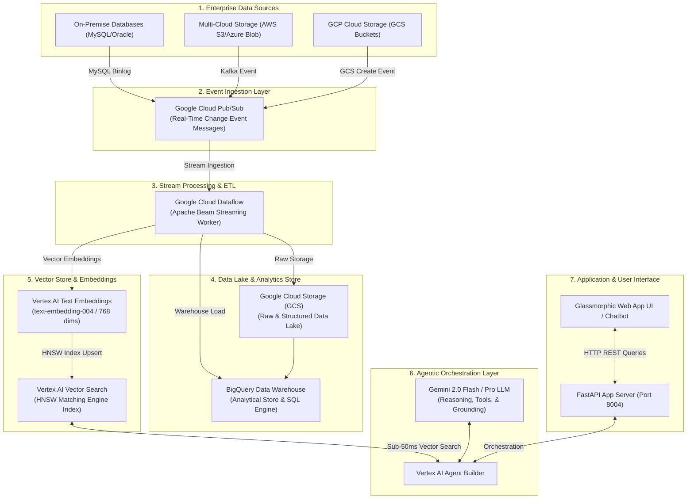

# Google Cloud Event-Driven Agentic RAG Architecture Diagram

This document contains the complete **Architecture Blueprint & Diagram** for the **Event-Driven Data Pipeline with Agentic RAG on GCP** (`gcp_agentic_rag_demo`).

---

## 🎨 1. Mermaid Architecture Flowchart



---

## 📋 2. High-Precision ASCII Architecture Diagram

```
┌───────────────────────────────────────────────────────────────────────────────────────────────────┐
│                                1. DATA SOURCE ANY (ON-PREM / MULTI-CLOUD / GCP)                   │
│   ┌───────────────────────────┐   ┌───────────────────────────┐   ┌────────────────────────────┐  │
│   │   On-Premise Databases    │   │ Multi-Cloud Storage (S3)  │   │  GCP Cloud Storage (GCS)   │  │
│   └─────────────┬─────────────┘   └─────────────┬─────────────┘   └─────────────┬──────────────┘  │
└─────────────────┼───────────────────────────────┼───────────────────────────────┼─────────────────┘
                  │ (MySQL Binlog)                │ (Kafka Event)                 │ (GCS Create Event)
                  ▼                               ▼                               ▼
┌───────────────────────────────────────────────────────────────────────────────────────────────────┐
│                                2. EVENT INGESTION / MESSAGING LAYER                               │
│  ┌─────────────────────────────────────────────────────────────────────────────────────────────┐  │
│  │  Google Cloud Pub/Sub (Real-Time Change Event Messages)                                     │  │
│  └───────────────────────────────────────────┬─────────────────────────────────────────────────┘  │
└──────────────────────────────────────────────┼────────────────────────────────────────────────────┘
                                               │
                                               ▼
┌───────────────────────────────────────────────────────────────────────────────────────────────────┐
│                               3. STREAM PROCESSING / ETL PIPELINE                                 │
│  ┌─────────────────────────────────────────────────────────────────────────────────────────────┐  │
│  │  Google Cloud Dataflow (Apache Beam Streaming Pipeline)                                     │  │
│  └───────────────────┬───────────────────────────────┬───────────────────────────────┬─────────┘  │
└──────────────────────┼───────────────────────────────┼───────────────────────────────┼────────────┘
                       │                               │                               │
                       ▼                               ▼                               ▼
┌──────────────────────────────┐    ┌──────────────────────────────┐    ┌───────────────────────────┐
│ Google Cloud Storage (GCS)   │    │ BigQuery Data Warehouse      │    │ Vertex AI Text Embeddings │
│ (Raw & Structured Data Lake) │───>│ (Analytical & SQL Storage)   │    │ (text-embedding-004)      │
└──────────────────────────────┘    └──────────────────────────────┘    └─────────────┬─────────────┘
                                                                                      │
                                                                                      ▼
┌───────────────────────────────────────────────────────────────────────────────────────────────────┐
│                                5. KNOWLEDGE BASE / VECTOR INDEX                                   │
│  ┌─────────────────────────────────────────────────────────────────────────────────────────────┐  │
│  │  Vertex AI Vector Search (Matching Engine HNSW Index)                                       │  │
│  └───────────────────────────────────────────┬─────────────────────────────────────────────────┘  │
└──────────────────────────────────────────────┼────────────────────────────────────────────────────┘
                                               │ (Sub-50ms Vector Search)
                                               ▼
┌───────────────────────────────────────────────────────────────────────────────────────────────────┐
│                                6. AGENTIC RAG PIPELINE (VERTEX AI)                                │
│  ┌─────────────────────────────────────────────────────────────────────────────────────────────┐  │
│  │  Vertex AI Agent Builder + Gemini 2.0 Flash / Pro LLM (Orchestration, Tools, Reasoning)    │  │
│  └───────────────────────────────────────────┬─────────────────────────────────────────────────┘  │
└──────────────────────────────────────────────┼────────────────────────────────────────────────────┘
                                               │
                                               ▼
┌───────────────────────────────────────────────────────────────────────────────────────────────────┐
│                                7. USER INTERFACE & END-USER APPLICATION                           │
│  ┌─────────────────────────────────────────────────────────────────────────────────────────────┐  │
│  │  FastAPI Server (Port 8004) + Glassmorphic Interactive Web App UI                           │  │
│  └─────────────────────────────────────────────────────────────────────────────────────────────┘  │
└───────────────────────────────────────────────────────────────────────────────────────────────────┘
```

---

## 🛠️ 3. Component Specification Directory

| Component | GCP Service | Architecture Role |
| :--- | :--- | :--- |
| **Data Sources** | On-Prem / AWS / GCP | Generates raw documents, SQL database change logs, and object updates. |
| **Event Messaging** | Google Cloud Pub/Sub | Captures real-time change events asynchronously with zero data loss. |
| **Stream Processing** | Cloud Dataflow (Apache Beam) | Executes streaming ETL, text extraction, chunking, and embedding dispatch. |
| **Data Lake** | Google Cloud Storage (GCS) | Immutable raw landing bucket for uploaded document objects. |
| **Data Warehouse** | BigQuery | Analytical warehouse storing structured records alongside vector metadata. |
| **Embedding Model** | Vertex AI Text Embeddings | Generates 768/3072-dimensional normalized vector representations. |
| **Vector Store** | Vertex AI Vector Search | High-throughput HNSW index executing similarity queries in $<50\text{ms}$. |
| **Agentic LLM** | Vertex AI Agent Builder + Gemini 2.0 | Executes multi-query planning, function calling tools, and grounded synthesis. |
| **Web Server & UI** | FastAPI (Port 8004) + Web UI | Interactive user application delivering chat interfaces and verified citations. |
