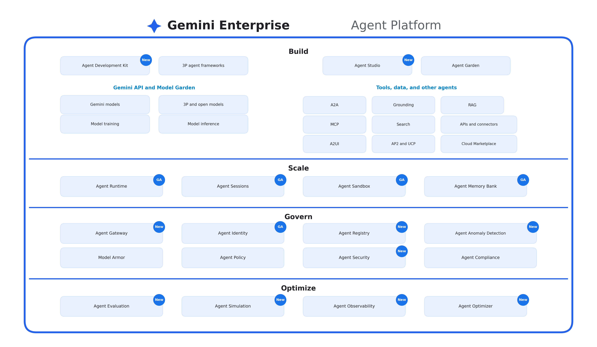

# Gemini Enterprise Agent Platform Architecture
## Comprehensive Enterprise Specification & Component Breakdown
### *Build • Scale • Govern • Optimize*



---

## 🏗️ 1. Executive Architecture Overview

The **Gemini Enterprise Agent Platform** provides an end-to-end, enterprise-grade operating system for building, scaling, governing, and optimizing autonomous AI agents. The platform is architected around **4 Core Lifecycle Layers**:

```
┌───────────────────────────────────────────────────────────────────────────────────────────────────┐
│                              GEMINI ENTERPRISE AGENT PLATFORM                                     │
├───────────────────────────────────────────────────────────────────────────────────────────────────┤
│ 1. BUILD     : Agent Development Kit (ADK), 3P Frameworks, Agent Studio, Models & Tools/RAG       │
│ 2. SCALE     : Agent Runtime, Agent Sessions, Agent Sandbox, Agent Memory Bank (All GA)          │
│ 3. GOVERN    : Agent Gateway, Agent Identity, Agent Registry, Anomaly Detection, Model Armor     │
│ 4. OPTIMIZE  : Agent Evaluation, Agent Simulation, Agent Observability, Agent Optimizer          │
└───────────────────────────────────────────────────────────────────────────────────────────────────┘
```

---

## 🛠️ 2. Pillar 1: Build

The **Build** layer provides the foundation models, development kits, and integrations required to assemble multi-agent systems.

### Core Frameworks & Studios:
* **Agent Development Kit (ADK)** `[New]`: Standardized Python/TypeScript SDK defining Agent personas, on-demand Skills, and function-calling Tools.
* **3P Agent Frameworks**: Native compatibility with open-source agent ecosystems (LangGraph, CrewAI, AutoGen, LlamaIndex).
* **Agent Studio** `[New]`: Low-code visual canvas for designing multi-turn dialog trees, intent routing, and slot filling.
* **Agent Garden**: A curated enterprise catalog of pre-built, domain-specific AI agents ready for turn-key deployment.

### Gemini API & Model Garden:
* **Gemini Models**: Gemini 2.0 Flash (low-latency agentic loops) and Gemini 2.0 Pro (complex multi-step planning).
* **3P and Open Models**: Support for open-weights models (Gemma 2, Llama 3.3, Mistral) on Vertex AI Model Garden.
* **Model Training & Model Inference**: Managed fine-tuning (PEFT/LoRA, RLHF) and high-throughput serverless inference.

### Tools, Data, and Other Agents:
* **A2A (Agent-to-Agent)**: Protocols for decentralized communication and sub-task delegation among agent swarms.
* **Grounding**: Verifiable grounding against Google Search, internal documents, and enterprise databases.
* **RAG (Retrieval-Augmented Generation)**: High-performance vector embeddings with Vertex AI Vector Search.
* **MCP (Model Context Protocol)**: Universal JSON-RPC 2.0 standard for connecting agents to database tools and APIs.
* **Search & APIs / Connectors**: Managed data connectors for BigQuery, Cloud Storage, Salesforce, Jira, and SAP.
* **A2UI & AP2 / UCP**: Agent-to-User-Interface streaming components and Unified Control Plane integrations.
* **Cloud Marketplace**: Commercial 3P tools, agents, and enterprise datasets.

---

## ⚡ 3. Pillar 2: Scale (All Generally Available - GA)

The **Scale** layer provides the production infrastructure required to execute agents reliably at global scale.

* **Agent Runtime** `[GA]`: Serverless, isolated execution environments on Google Cloud Run and GKE.
* **Agent Sessions** `[GA]`: Stateful multi-turn conversation and context management with distributed locks.
* **Agent Sandbox** `[GA]`: Hermetic, secure compute sandbox for executing untrusted agent code or Python scripts safely.
* **Agent Memory Bank** `[GA]`: Multi-tiered episodic, semantic, and working memory powered by Cloud Spanner and Firestore.

---

## 🛡️ 4. Pillar 3: Govern

The **Govern** layer enforces military-grade enterprise security, policy guardrails, and compliance standards.

* **Agent Gateway** `[New]`: Centralized API gateway managing rate-limiting, authentication, and routing for all agent traffic.
* **Agent Identity** `[GA]`: Workload Identity Federation binding each AI agent to a distinct IAM Service Account with least privilege.
* **Agent Registry** `[New]`: Enterprise directory registering versioned agent metadata, tool schemas, and ownership.
* **Agent Anomaly Detection** `[New]`: Real-time machine learning detecting rogue agent loops, infinite loops, and token spikes.
* **Model Armor**: Pre-inference safety filter blocking prompt injection, jailbreak attempts, and toxic inputs.
* **Agent Policy & Agent Security** `[New]`: Deterministic guardrails preventing unapproved API calls or sensitive data exfiltration.
* **Agent Compliance**: Continuous automated audit logging for HIPAA, SOC 2, ISO 27001, and GDPR adherence.

---

## 📈 5. Pillar 4: Optimize

The **Optimize** layer ensures continuous performance tuning, factual accuracy, and cost efficiency.

* **Agent Evaluation** `[New]`: Automated LLM-as-a-Judge test suites scoring Faithfulness, Answer Relevance, and Groundedness.
* **Agent Simulation** `[New]`: Synthetic user simulation generating thousands of multi-turn edge cases in staging environments.
* **Agent Observability** `[New]`: Distributed tracing with Cloud Trace and structured Cloud Logging capturing every thought, tool call, and latency metric.
* **Agent Optimizer** `[New]`: Automated prompt compression, context caching tuning, and model routing to minimize cost and latency.
