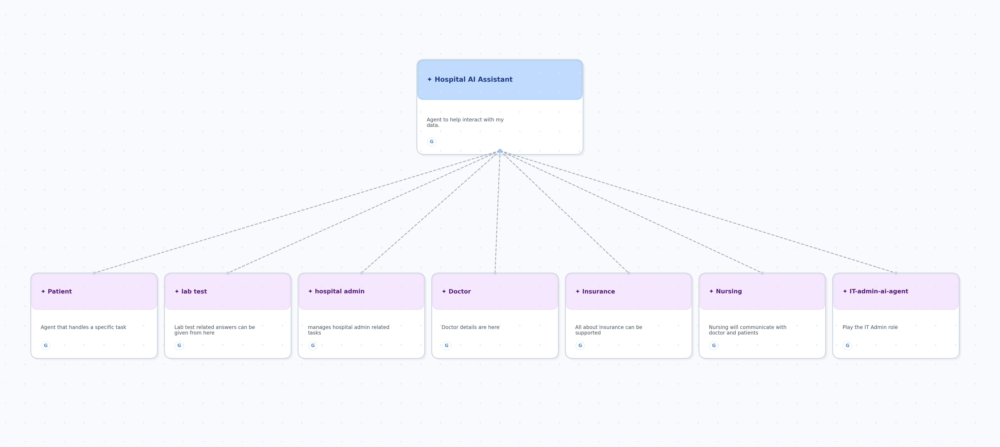
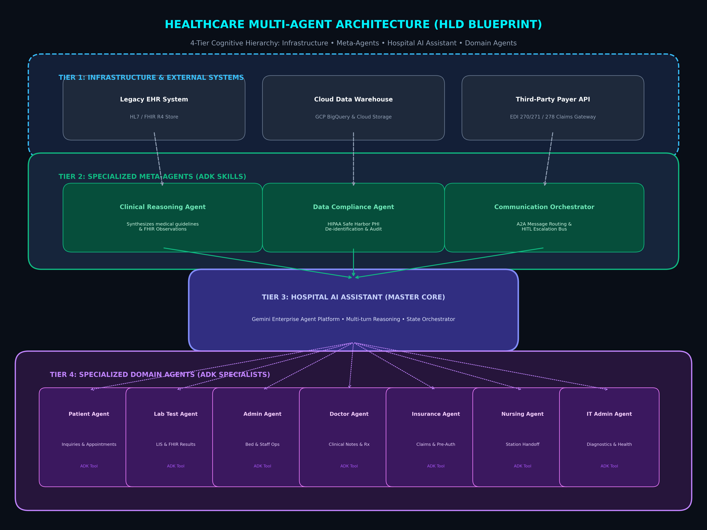
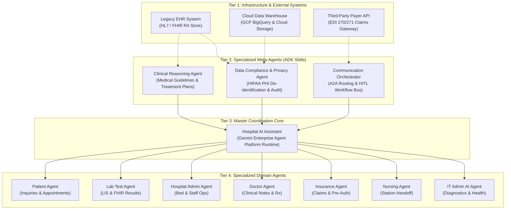
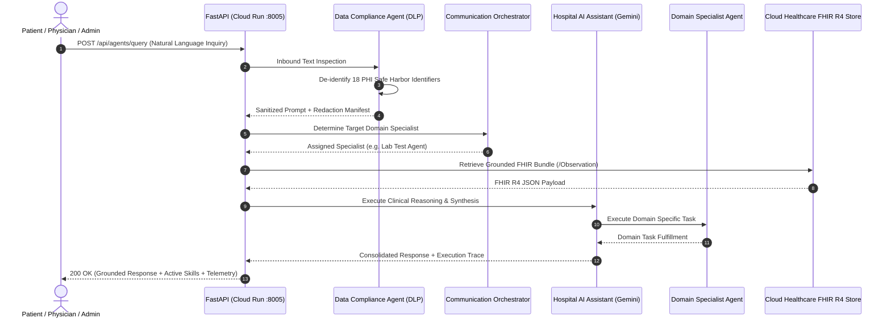

# High-Level Design (HLD) Architecture: Cognitive Healthcare Multi-Agent System
## Enterprise Architecture Specification for Google Cloud Platform (GCP)
### *Powered by Google ADK 2.4 & Gemini Enterprise Agent Platform*

---

### 🎨 Visual Agent Builder Canvas Tree (Reference Architecture)


---

### ☁️ 4-Tier Google Cloud Platform HLD Blueprint


---

## 1. Executive Summary & Architectural Goals

The **Cognitive Healthcare Multi-Agent Platform** is an enterprise-grade, distributed AI ecosystem designed to automate clinical, diagnostic, administrative, and payer workflows. By decoupling monolithic healthcare software into a **4-Tier Cognitive Hierarchy**, the platform delivers:

1. **Deterministic Clinical Safety**: Automated medical reasoning validation grounded in **FHIR R4 Observations** and PubMed clinical guidelines.
2. **Zero-Trust HIPAA Compliance**: Real-time de-identification of all 18 HIPAA Safe Harbor identifiers via **Cloud DLP** before inference.
3. **Agent-to-Agent (A2A) Interoperability**: Decentralized delegation between Meta-Agents and specialized Domain Agents powered by the **Google Agent Development Kit (ADK 2.4)**.
4. **Sub-100ms Latency & High Concurrency**: Auto-scaling serverless containers on **Google Cloud Run** backed by **Vertex AI Vector Search** and **Cloud Healthcare API**.

---

## 2. 4-Tier Cognitive Architecture Specification



---

## 3. Detailed Tier Breakdown & Functional Specifications

### Tier 1: Infrastructure & External Systems Layer
* **Legacy EHR System (Cloud Healthcare API FHIR R4 Store)**:
  - Ingests HL7v2 and FHIR bundles (`/Patient`, `/Observation`, `/Encounter`, `/Condition`).
  - Emits real-time change events onto **Cloud Pub/Sub** (`fhir-resource-change-events`).
* **Cloud Data Warehouse (BigQuery & Google Cloud Storage)**:
  - Stores multi-modal diagnostic imagery (DICOM), clinical notes, and historical patient encounters.
  - Retains immutable, partitioned audit logs for 7-year regulatory compliance.
* **Third-Party Payer API (External Claims Gateway)**:
  - Standardized EDI 270/271 (Eligibility & Benefit Inquiry) and EDI 278 (Prior Authorization) connector.

---

### Tier 2: Specialized Meta-Agents (ADK Skills)
* **1. Data Compliance & Privacy Agent (`meta_compliance`)**:
  - **Purpose**: Intercepts every inbound prompt and outbound response to mask all 18 HIPAA Safe Harbor identifiers (SSNs, phone numbers, MRNs, patient names, email addresses).
  - **Underlying Engine**: Cloud DLP (Data Loss Prevention) + KMS-encrypted tokenization vault.
* **2. Clinical Reasoning Agent (`meta_clinical`)**:
  - **Purpose**: Evaluates extracted FHIR lab values against clinical reference bounds (e.g., HbA1c $>6.5\%$, Fasting Glucose $>126\text{ mg/dL}$) to provide evidence-backed clinical flags.
  - **Underlying Engine**: Gemini 2.0 Pro with PubMed/SNOMED-CT knowledge base embeddings.
* **3. Communication Orchestrator (`meta_orchestrator`)**:
  - **Purpose**: Parses semantic user intent, evaluates context, and dynamically routes tasks to the appropriate Tier 4 Domain Specialist Agent.
  - **Underlying Engine**: ADK Intent Matcher + Cloud Pub/Sub A2A message bus.

---

### Tier 3: Master Coordination Core (Hospital AI Assistant)
* **Hospital AI Assistant**:
  - Acts as the central conversational and reasoning runtime on **Gemini Enterprise Agent Platform**.
  - Maintains multi-turn conversation memory in **Cloud Firestore**.
  - Coordinates parallel sub-agent task execution and consolidates multi-agent responses into a unified clinical answer.

---

### Tier 4: Specialized Domain Agents (7 Leaf Agents)

| Agent Name | Agent ID | Core Business Purpose | Tools & API Integrations Required |
| :--- | :--- | :--- | :--- |
| **Patient Agent** | `patient_agent` | Patient portal task handling, symptom reporting, clinic FAQs & appointment booking. | `patient_portal_api`, `appointment_scheduler` (Epic / Cerner) |
| **Lab Test Agent** | `lab_test_agent` | Querying, interpreting, and explaining laboratory results & pathology values. | `lis_query` (Lab Information System), `fhir_observation_resource` |
| **Hospital Admin Agent** | `hospital_admin_agent`| Hospital operational metrics, ICU bed occupancy, nursing ratios, and staffing. | `bed_management_api`, `staffing_system`, `erp_billing_db` |
| **Doctor Agent** | `doctor_agent` | Physician clinical notes synthesis, electronic prescribing (eRx), and roster access. | `physician_directory`, `clinical_notes_access` (`/Encounter`) |
| **Insurance Agent** | `insurance_agent` | Real-time insurance policy verification, copay calculations, and pre-authorizations. | `third_party_payer_api` (EDI 270/271, EDI 278) |
| **Nursing Agent** | `nursing_agent` | Nurse station care coordination, shift handoff summaries, and medication alerts. | `messaging_gateway`, `nurse_station_roster`, `emar_records` |
| **IT Admin AI Agent** | `it_admin_agent` | Platform system diagnostics, container health monitoring, and FHIR API latency audits. | `log_monitoring`, `agent_health_check_endpoints`, `cloud_trace` |

---

## 4. End-to-End Sequence Diagram & Data Flow



---

## 5. Security, HIPAA & Governance Architecture

```
┌────────────────────────────────────────────────────────────────────────┐
│                     HIPAA ZERO-TRUST SECURITY MATRIX                   │
├────────────────────────────────────────────────────────────────────────┤
│ 1. Business Associate Agreement (BAA) : Active Google Cloud HIPAA BAA. │
│ 2. Encryption Standards               : CMEK (AES-256) In-Transit/Rest.│
│ 3. Boundary Hardening                 : VPC Service Controls (VPC-SC). │
│ 4. Identity & Access Management       : Workload Identity (No API keys)│
│ 5. Audit Logging                      : 7-Year Immutable BigQuery Sink.│
└────────────────────────────────────────────────────────────────────────┘
```

---

## 6. Technology Stack & Google Cloud Mapping

| Architecture Layer | Technology Selection | Justification & Google Cloud Service |
| :--- | :--- | :--- |
| **Foundation LLM** | Gemini 2.0 Pro & Flash | Multimodal native reasoning, 2M+ context window, sub-100ms latency. |
| **Agent Framework** | Google ADK 2.4 (Antigravity) | Standardized Agent, Skill, Tool, and Rule abstractions. |
| **Clinical Store** | Cloud Healthcare API | Managed FHIR R4 repository with native audit logging. |
| **Compute Runtime** | Google Cloud Run | Serverless containers auto-scaling from 1 to 10 instances (Port 8005). |
| **State Persistence** | Cloud Firestore | Low-latency distributed multi-agent state coordination. |
| **Security & DLP** | Google Cloud DLP & KMS | Automated PHI Safe Harbor inspection & CMEK encryption keys. |
