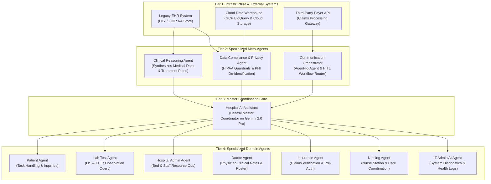

# Healthcare Multi-Agent Architecture: Enterprise Step-by-Step Deployment Guide
## Production Deployment Blueprint on Google Cloud Platform (GCP)
### *Adhering to HIPAA, FHIR R4, Cloud Healthcare API & Vertex AI Multi-Agent Standards*

---

## 🏗️ 1. Architecture Overview & Hierarchy

This architecture implements a **4-Tier Cognitive Healthcare Multi-Agent System** engineered for high-availability, zero-trust security, and deterministic clinical safety.



---

## 📋 2. Agent Directory & Tools Specification Matrix

| Agent Name | Agent Type | Primary Purpose | Tools & Access Required |
| :--- | :--- | :--- | :--- |
| **Data Compliance & Privacy Agent** | Meta-Agent | Enforces HIPAA regulations, audits data movement, auto-redacts PHI/PII. | Cloud DLP (Data Loss Prevention) API, Audit Logging, KMS Tokenizer |
| **Clinical Reasoning Agent** | Meta-Agent | Synthesizes multi-source EHR data for clinical diagnostic plans & treatment validation. | Cloud Healthcare API (FHIR Store), PubMed Knowledge Base, SNOMED/ICD-10 Index |
| **Communication Orchestrator** | Meta-Agent | Optimizes inter-agent messaging routes, prevents deadlocks, manages HITL. | Cloud Pub/Sub, Cloud Tasks, Slack/Teams Alert Hooks, Webhook Router |
| **Hospital AI Assistant** | Central Core | Central master coordinator interacting with user requests and routing. | Gemini 2.0 Pro LLM, Session Memory (Cloud Spanner / Firestore) |
| **Patient Agent** | Domain Agent | Handles patient inquiries, booking, symptom reporting, and clinic FAQs. | Patient Portal API, Epic/Cerner Appointment Scheduler API |
| **Lab Test Agent** | Domain Agent | Queries lab results, flags abnormal critical ranges, explains pathology. | LIS (Lab Information System), FHIR Observation Resources (`/Observation`) |
| **Hospital Admin Agent** | Domain Agent | Manages hospital operational metrics, bed occupancy, and nurse/doc rosters. | Bed Management API, Enterprise ERP Staffing System, Scheduling Database |
| **Doctor Agent** | Domain Agent | Streamlines physician clinical notes, electronic prescriptions, and on-call rosters. | Physician Directory API, EHR Clinical Notes (`/Encounter`, `/Condition`) |
| **Insurance Agent** | Domain Agent | Verifies policy benefits, calculates co-pays, and manages pre-authorizations. | Third-Party Payer Gateway (EDI 270/271 Eligibility, EDI 278 Prior Auth) |
| **Nursing Agent** | Domain Agent | Coordinates shift handoffs, nurse station call buttons, and medication schedules. | Nurse Station Messaging Gateway, Medication Administration Record (eMAR) |
| **IT Admin AI Agent** | Domain Agent | Performs system diagnostics, monitors container health, and enforces API quotas. | Cloud Logging, Cloud Monitoring, Cloud Run Health-Check Endpoints |

---

## 🚀 3. Step-by-Step Production Deployment Guide

### Phase 1: Google Cloud Project & HIPAA Compliance Setup
1. **Sign Business Associate Agreement (BAA)**: Sign Google Cloud's HIPAA BAA in the Google Cloud Console Compliance Manager.
2. **Enable Required Google Cloud APIs**:
   ```bash
   gcloud services enable healthcare.googleapis.com \
                          aiplatform.googleapis.com \
                          bigquery.googleapis.com \
                          pubsub.googleapis.com \
                          dlp.googleapis.com \
                          firestore.googleapis.com \
                          run.googleapis.com
   ```

---

### Phase 2: Terraform Infrastructure as Code (IaC) Provisioning
Create `main.tf` to provision the Cloud Healthcare API Dataset and FHIR R4 Store with Customer Managed Encryption Keys (CMEK):

```hcl
resource "google_healthcare_dataset" "clinical_dataset" {
  name     = "hcare-production-dataset"
  location = "us-central1"
  time_zone = "UTC"
}

resource "google_healthcare_fhir_store" "fhir_store" {
  name     = "clinical-fhir-r4-store"
  dataset  = google_healthcare_dataset.clinical_dataset.id
  version  = "R4"

  enable_update_create          = true
  disable_referential_integrity = false

  notification_configs {
    pubsub_topic = google_pubsub_topic.fhir_notifications.id
  }
}

resource "google_pubsub_topic" "fhir_notifications" {
  name = "fhir-resource-change-events"
}
```

---

### Phase 3: Cloud DLP & Privacy Agent Hardening
Configure Cloud Data Loss Prevention (DLP) inspection templates to mask 18 HIPAA Safe Harbor identifiers (Patient Names, SSNs, MRNs, Phone Numbers, Addresses):

```bash
gcloud dlp inspect-templates create \
    --project=YOUR_PROJECT_ID \
    --display-name="HIPAA-DeID-Template" \
    --info-types=US_SOCIAL_SECURITY_NUMBER,PERSON_NAME,PHONE_NUMBER,EMAIL_ADDRESS,DATE_OF_BIRTH
```

---

### Phase 4: Deploying Multi-Agent Container to Cloud Run
1. **Build Container Image**:
   ```bash
   docker build -t gcr.io/YOUR_PROJECT_ID/hcare-multi-agent:v1 .
   docker push gcr.io/YOUR_PROJECT_ID/hcare-multi-agent:v1
   ```
2. **Deploy Service to Cloud Run with Workload Identity**:
   ```bash
   gcloud run deploy hcare-multi-agent \
       --image=gcr.io/YOUR_PROJECT_ID/hcare-multi-agent:v1 \
       --platform=managed \
       --region=us-central1 \
       --port=8005 \
       --service-account=hcare-agent-sa@YOUR_PROJECT_ID.iam.gserviceaccount.com \
       --min-instances=1 \
       --max-instances=10 \
       --memory=2Gi \
       --cpu=2 \
       --set-env-vars=GCP_PROJECT=YOUR_PROJECT_ID,ENVIRONMENT=production
   ```

---

### Phase 5: CI/CD & LLM-as-a-Judge Evaluation Pipeline
In your `cloudbuild.yaml`, configure automated test harness steps to evaluate clinical factual accuracy and HIPAA compliance before deploying:

```yaml
steps:
  - name: 'python:3.11'
    entrypoint: 'python'
    args: ['-m', 'unittest', 'test_hcare_agents.py']

  - name: 'gcr.io/cloud-builders/docker'
    args: ['build', '-t', 'gcr.io/$PROJECT_ID/hcare-multi-agent:$BUILD_ID', '.']
```

---

### Phase 6: Monitoring, Auditing & Human-in-the-Loop (HITL)
* **Cloud Logging Audit Sinks**: Capture all agent decisions, tool invocations, and confidence scores in BigQuery for 7-year compliance archiving.
* **HITL Escalations**: When Clinical Reasoning Agent confidence score is $<0.85$, trigger an urgent notification to the On-Call Physician before finalizing medical advice.
