```mermaid
graph TD
    %% Define Nodes
    Dev["👤 Developer<br>(Git Push / PR)"]
    GH["🐙 GitHub Repository<br>(Source Control)"]
    
    subgraph AWS ["Amazon Web Services Boundary"]
        GHA["⚙️ GitHub Actions / CodeBuild<br>(CI/CD Pipeline)"]
        ECR["📦 Amazon ECR<br>(Container Registry)"]
        AppRunner["🚀 AWS App Runner<br>(Serverless Compute)"]
        RDS["🗄️ Amazon RDS / Aurora<br>(Database)"]
    end

    %% Connections
    Dev -->|1. Push Code| GH
    GH -->|2. Trigger Workflow| GHA
    
    %% Pipeline Steps
    GHA -.->|A. Run Jest Tests| GHA
    GHA -.->|B. Terraform Init & Apply| GHA
    GHA -.->|C. Docker Build & Tag| GHA
    
    GHA -->|3. Provision Infrastructure| ECR
    GHA -->|3. Provision Infrastructure| AppRunner
    GHA -->|4. Push Docker Image| ECR
    GHA -->|5. Start Service Deployment| AppRunner
    AppRunner -->|6. Secure Data Routing| RDS

    %% Styling
    style AWS fill:#0f141c,stroke:#ff9900,stroke-width:2px;
    style GHA fill:#1c2536,stroke:#ff9900;
    style ECR fill:#1c2536,stroke:#232f3e;
    style AppRunner fill:#1c2536,stroke:#ff9900;
    style RDS fill:#1c2536,stroke:#ec7211;
```

# Multi-Cloud DevOps Architecture Reference Diagrams

This document details the DevOps pipelines and architectural designs implemented in code for Microsoft Azure, Google Cloud Platform (GCP), and Amazon Web Services (AWS).

---

## 1. Google Cloud Platform (GCP) DevOps Architecture

### Architecture Flowchart

```mermaid
graph TD
    %% Define Nodes
    Dev["👤 Developer<br>(Git Push / PR)"]
    GH["🐙 GitHub Repository<br>(Source Control)"]
    
    subgraph GCP ["Google Cloud Platform Boundary"]
        CB["⚙️ Google Cloud Build<br>(CI/CD Pipeline)"]
        AR["📦 Artifact Registry<br>(Docker Registry)"]
        CR["🚀 Google Cloud Run<br>(Serverless Compute)"]
        SQL["🗄️ Google Cloud SQL<br>(PostgreSQL DB)"]
    end
    
    Slack["💬 Slack / Notifications<br>(Optional Integration)"]

    %% Connections
    Dev -->|1. Push Code| GH
    GH -->|2. Webhook Trigger| CB
    
    %% Cloud Build Pipeline Steps
    CB -.->|A. Run Tests (npm test)| CB
    CB -.->|B. Terraform Init & Apply| CB
    CB -.->|C. Docker Build & Scan| CB
    
    CB -->|3. Provision Infrastructure| AR
    CB -->|3. Provision Infrastructure| CR
    CB -->|4. Push Docker Image| AR
    CB -->|5. Deploy Container| CR
    CR -->|6. Secure Database Connection| SQL
    CB -->|7. Send Build Status| Slack

    %% Styling
    style GCP fill:#0c1020,stroke:#4285f4,stroke-width:2px;
    style CB fill:#132038,stroke:#4285f4;
    style AR fill:#132038,stroke:#34a853;
    style CR fill:#132038,stroke:#ea4335;
    style SQL fill:#132038,stroke:#fbbc05;
```

### Key Components & Code Matches
* **CI/CD Orchestration**: Triggered via [cloudbuild.yaml](file:///Users/biswanathgiri/GenAI&AgenticAI%20-Learing%20Roadmap/cloudbuild.yaml) or [gcp-deploy.yml](file:///Users/biswanathgiri/GenAI&AgenticAI%20-Learing%20Roadmap/gcp-devops-demo-project/.github/workflows/gcp-deploy.yml).
* **Infrastructure-as-Code**: Handled by HashiCorp Terraform in the [gcp-devops-demo-project/infra](file:///Users/biswanathgiri/GenAI&AgenticAI%20-Learing%20Roadmap/gcp-devops-demo-project/infra) directory, provisioning the repository and serverless container runner.
* **Hosting Model**: Containerized Node.js application deployed to serverless **Google Cloud Run** running on port `8080` with public IAM bindings.

---

## 2. Amazon Web Services (AWS) DevOps Architecture

### Architecture Flowchart



### Key Components & Code Matches
* **CI/CD Orchestration**: Triggered via [aws-deploy.yml](file:///Users/biswanathgiri/GenAI&AgenticAI%20-Learing%20Roadmap/aws-devops-demo-project/.github/workflows/aws-deploy.yml) or [buildspec.yml](file:///Users/biswanathgiri/GenAI&AgenticAI%20-Learing%20Roadmap/aws-devops-demo-project/buildspec.yml).
* **Infrastructure-as-Code**: Provisioned via Terraform in the [aws-devops-demo-project/infra](file:///Users/biswanathgiri/GenAI&AgenticAI%20-Learing%20Roadmap/aws-devops-demo-project/infra) directory, creating an Elastic Container Registry (ECR) repository and an AWS App Runner serverless instance.
* **Hosting Model**: Serverless hosting via **AWS App Runner** utilizing execution roles for container downloads from ECR.

---

## 3. Microsoft Azure DevOps Architecture

### Architecture Flowchart

```mermaid
graph TD
    %% Define Nodes
    Dev["👤 Developer<br>(Git Push / PR)"]
    GH["🐙 GitHub Repository<br>(Source Control)"]
    
    subgraph Azure ["Microsoft Azure Boundary"]
        GHA["⚙️ GitHub Actions / Pipelines<br>(CI/CD Pipeline)"]
        AppService["🚀 Azure App Service<br>(Web App)"]
        ASP["📋 App Service Plan<br>(Compute Tier)"]
        AppInsights["📈 Application Insights<br>(Monitoring)"]
    end

    %% Connections
    Dev -->|1. Push Code| GH
    GH -->|2. Trigger Workflow| GHA
    
    %% Pipeline Steps
    GHA -.->|A. Run Node.js Tests| GHA
    GHA -.->|B. Azure CLI Login (OIDC/Key)| GHA
    GHA -.->|C. Bicep Deploy IaC| GHA
    GHA -.->|D. Zip Application Code| GHA
    
    GHA -->|3. Provision Infrastructure| ASP
    GHA -->|3. Provision Infrastructure| AppService
    GHA -->|3. Provision Monitoring| AppInsights
    GHA -->|4. Deploy Zip Package| AppService
    AppService -->|5. Send Telemetry Logs| AppInsights

    %% Styling
    style Azure fill:#07111e,stroke:#0078d4,stroke-width:2px;
    style GHA fill:#0d2240,stroke:#0078d4;
    style AppService fill:#0d2240,stroke:#39a3f0;
    style ASP fill:#0d2240,stroke:#2b579a;
    style AppInsights fill:#0d2240,stroke:#00a300;
```

### Key Components & Code Matches
* **CI/CD Orchestration**: Configured in [azure-deploy.yml](file:///Users/biswanathgiri/GenAI&AgenticAI%20-Learing%20Roadmap/azure-devops-demo-project/.github/workflows/azure-deploy.yml) or the root-level Azure DevOps Pipeline config [azure-pipelines.yml](file:///Users/biswanathgiri/GenAI&AgenticAI%20-Learing%20Roadmap/azure-pipelines.yml).
* **Infrastructure-as-Code**: Deployed using Microsoft Bicep in [azure-devops-demo-project/infra/main.bicep](file:///Users/biswanathgiri/GenAI&AgenticAI%20-Learing%20Roadmap/azure-devops-demo-project/infra/main.bicep).
* **Hosting Model**: Node.js package deployed directly to **Azure Web App** running on Linux instances coupled with Application Insights diagnostics telemetry.
